## Intro
Log4j impact manufacturers and components summary from the Internet community. Welcome everyone to submit mr to perfect the possible influence surface.

## Affect the internet manufacturer

#### Apple
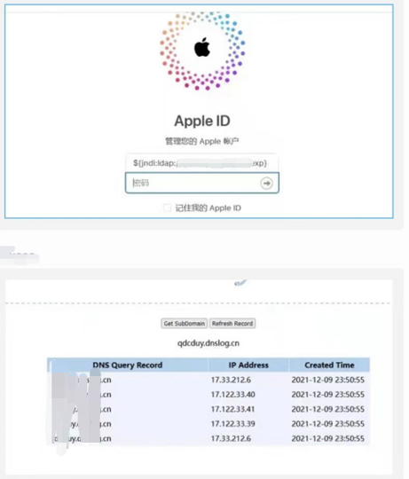
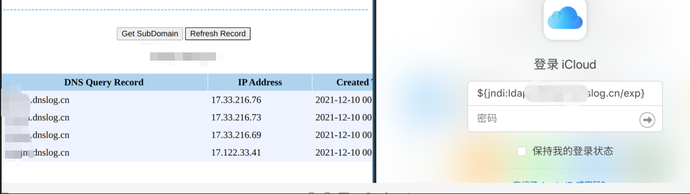
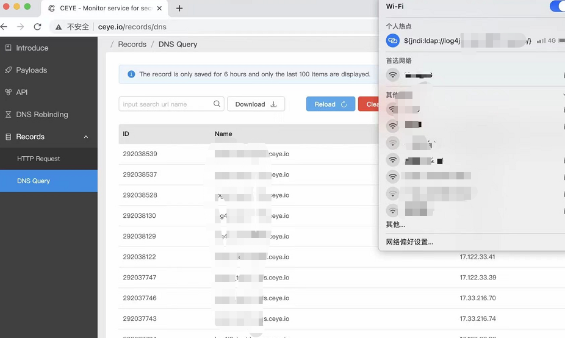
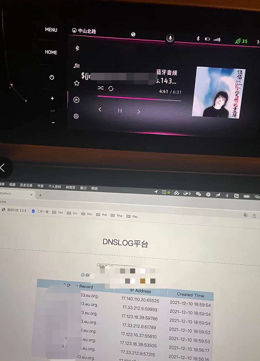

#### Tencent
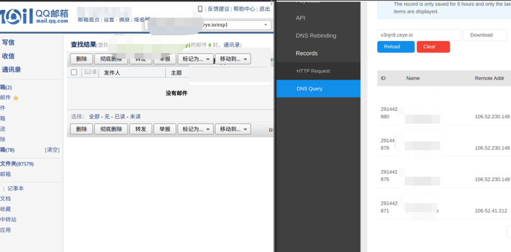
#### steam
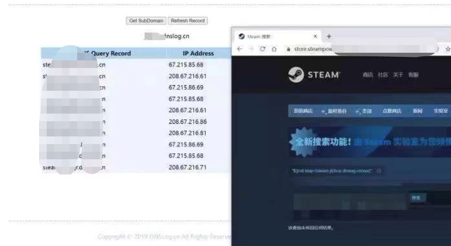
#### twitter
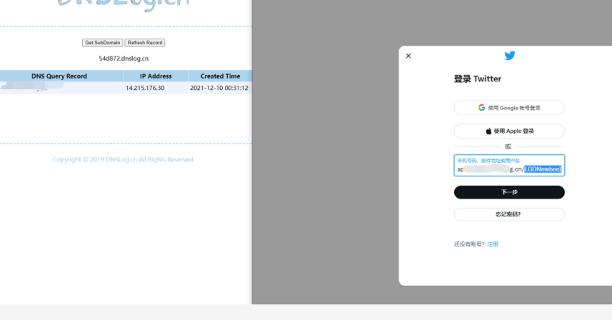
#### Baidu
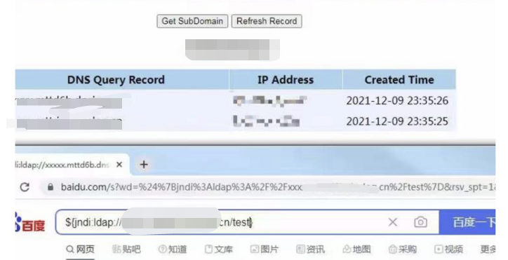
#### DIDI
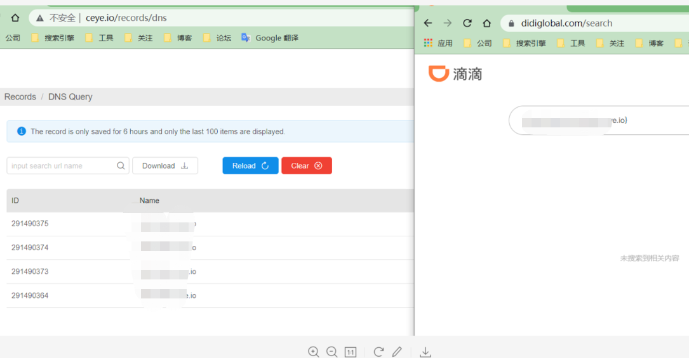
#### JD
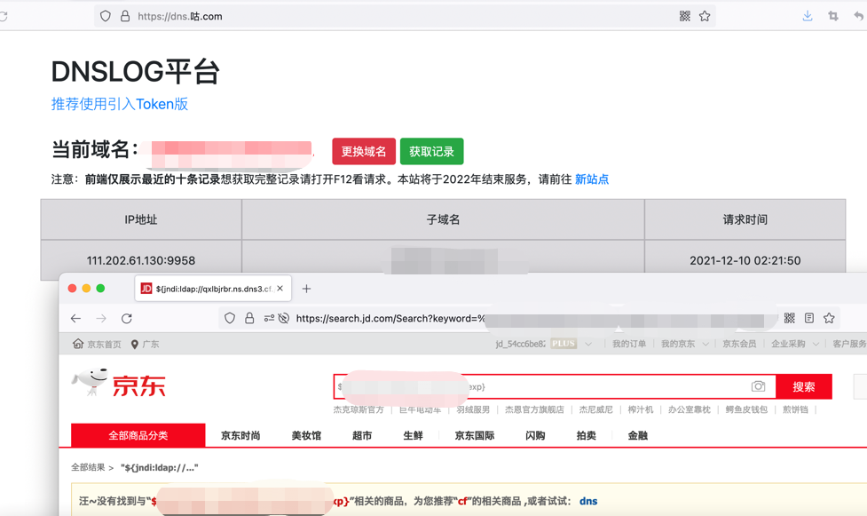
#### NetEase
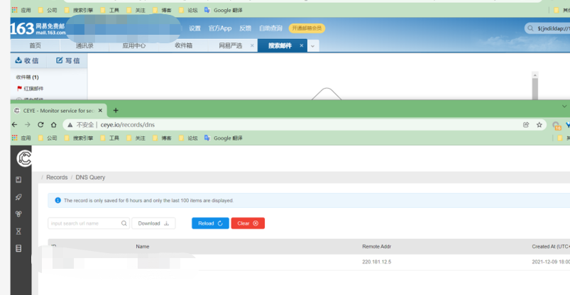

#### CloudFlare
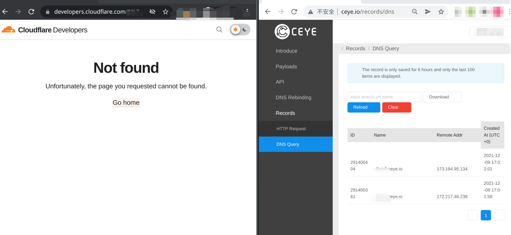

#### Amazon
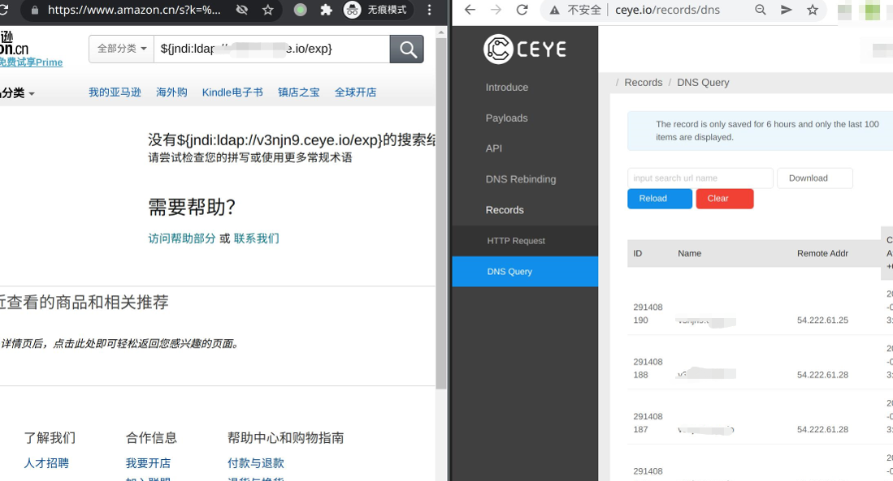

#### Tesla
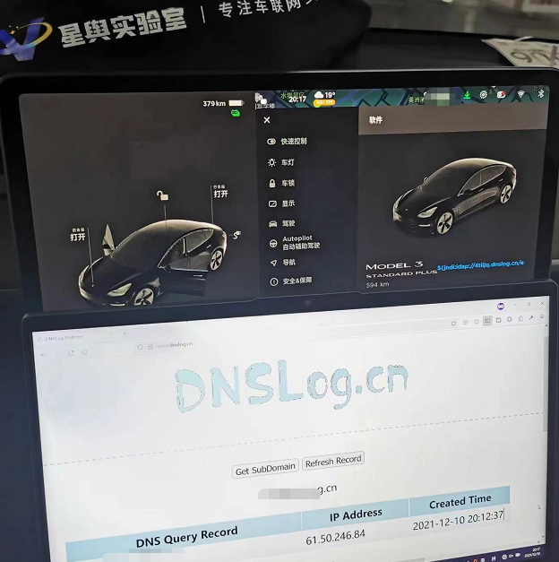

#### To be continued

## Affect the components

#### Apache Solr
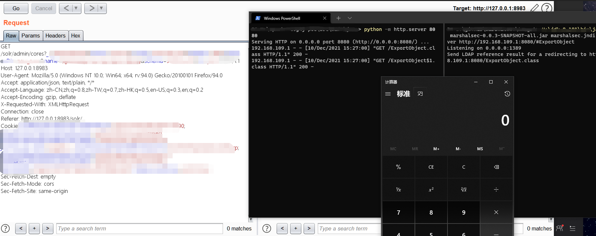

#### Apache Druid
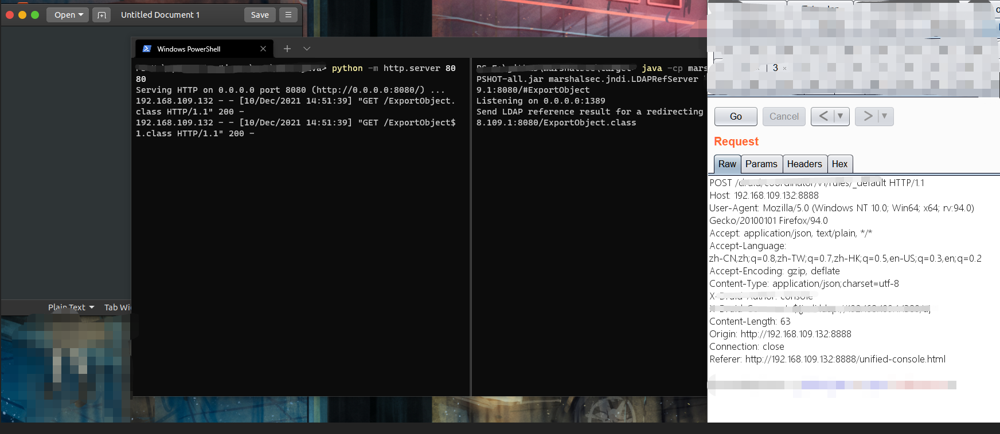

#### Apache Flink

#### Apache Struts2
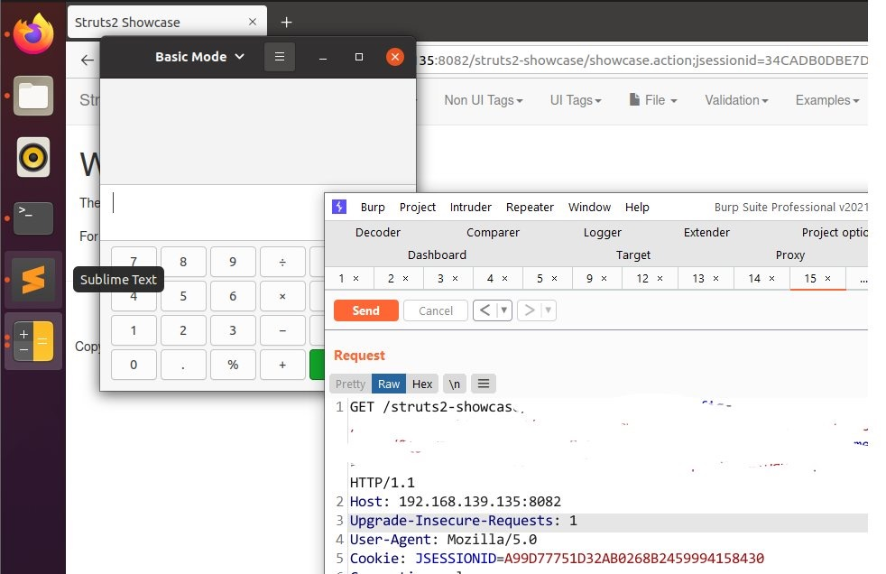

#### flume

#### dubbo

#### IBM Qradar SIEM

- /opt/qradar/support/mod_log4j.pl

- [logging](https://www.ibm.com/mysupport/s/question/0D50z00006PEIeQCAX/qradar-qradarlog-and-qradarerror-slf4j-this-version-of-slf4j-requires-log4j-version-1212-or-later?language=en_US)

#### PaloAlto Panorama

- [logging](https://docs.paloaltonetworks.com/oss-listings/panorama-oss-listings/panorama-10-0-open-source-software-oss-listing.html)

#### Redis

#### Elastic

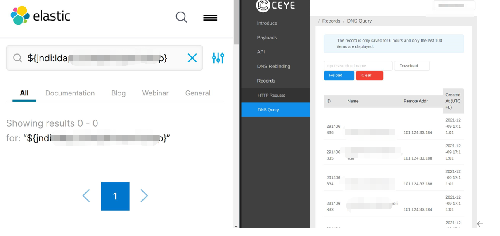

#### kafka

#### ghidra
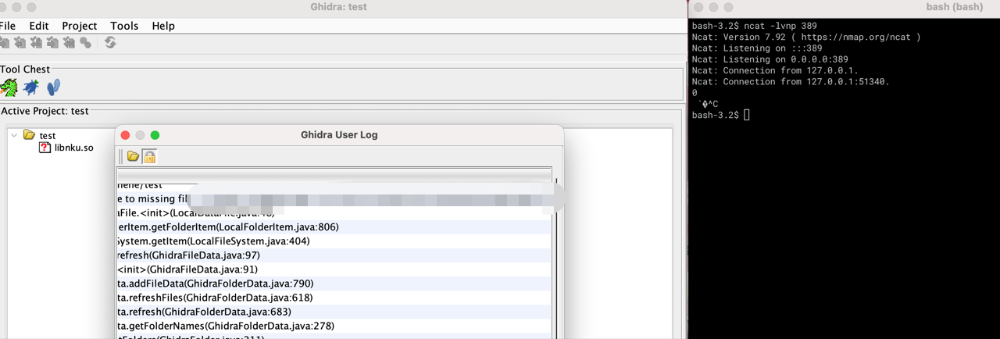

#### ghidra server
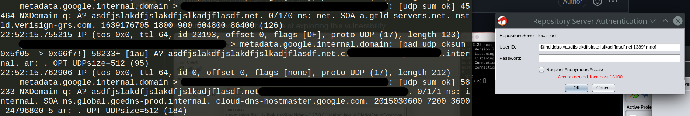

#### Minecraft
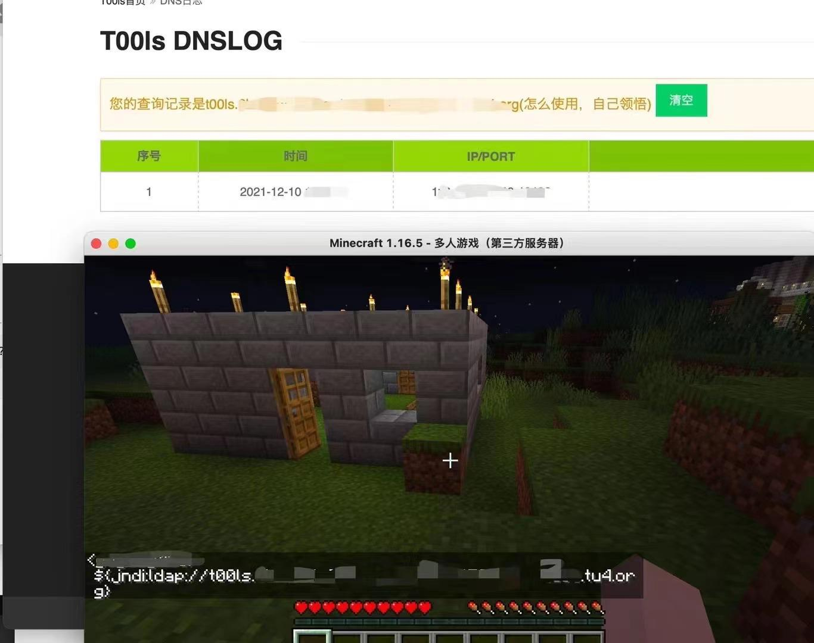

#### PulseSecure
- [KB44933 - CVE-2021-44228 - Java logging library (log4j)](https://kb.pulsesecure.net/pkb_mobile#article/l:en_US/KB44933/s)

#### UniFi
- [UniFi Network Application 6.5.54](https://community.ui.com/releases/UniFi-Network-Application-6-5-54/d717f241-48bb-4979-8b10-99db36ddabe1)

#### VMWare

- vCenter, vCloud 

- [kb.vmware.com/s/global-search/%40uri#q=Log4j](https://kb.vmware.com/s/global-search/%40uri#q=Log4j&t=MoreContent&sort=relevancy)
- [VMware Response to CVE-2021-44228: Apache Log4j Remote Code Execution (87068)](https://kb.vmware.com/s/article/87068?lang=en_US)
~~~
A critical vulnerability in Apache Log4j identified by CVE-2021-44228 
has been disclosed that may allow for remote code execution.
VMware has classified this issue as critical and is working on 
publishing fixes and workarounds as a priority.
~~~
