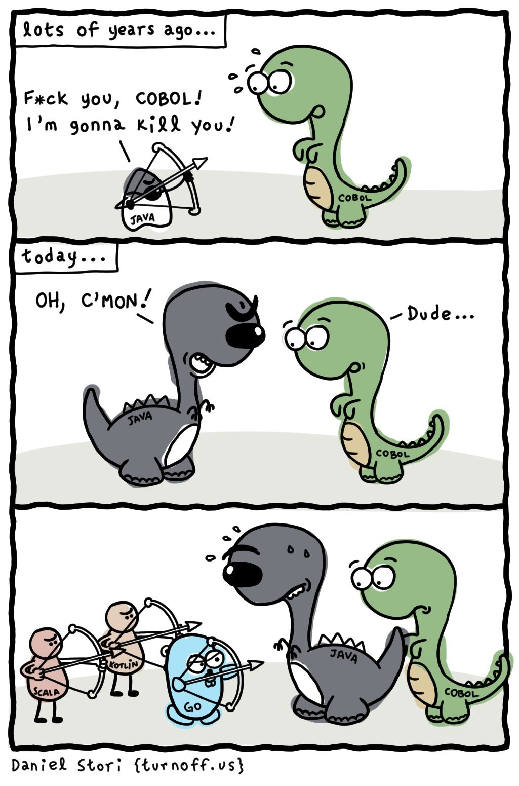
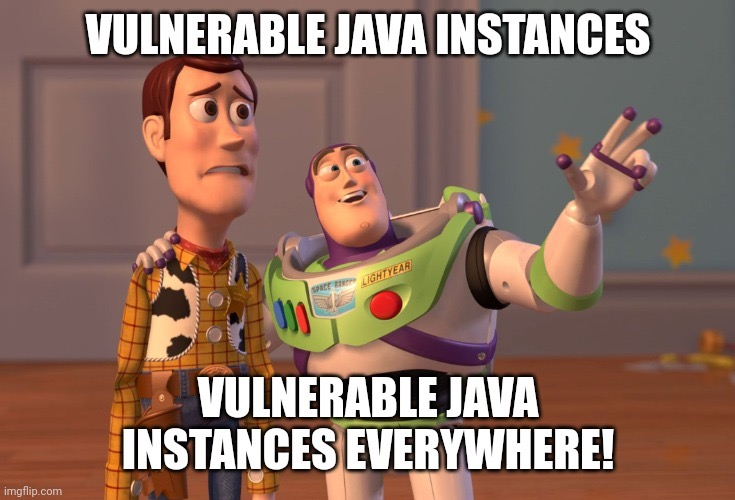
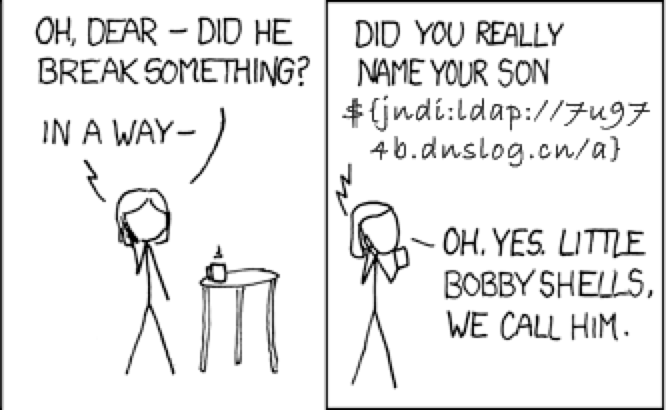

### [0x00](https://github.com/apache/logging-log4j2/pull/608#issuecomment-991418303) Case of https://www.explainxkcd.com/wiki/index.php/2347:_Dependency ? 
> Also, if this matters to you so much, why not show it with a donation to ... or this project's main contributor https://github.com/sponsors/rgoers ?

### 0x01

### 0x02

### 0x03

### 0x04

### 0x05

### 0x06

### 0x07

### 0x08

### 0x09

### 0x0a

### 0x0b

### 0x0c

### 0x0d

